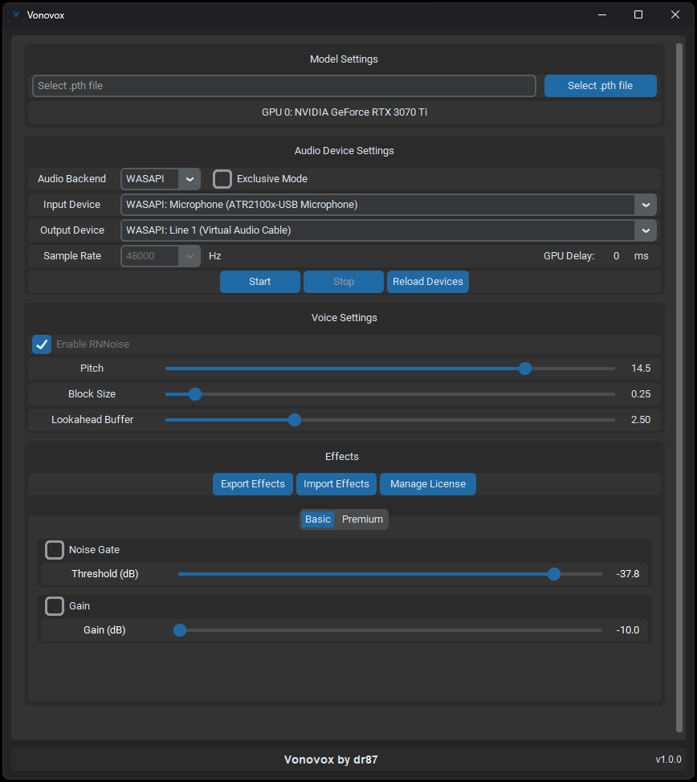
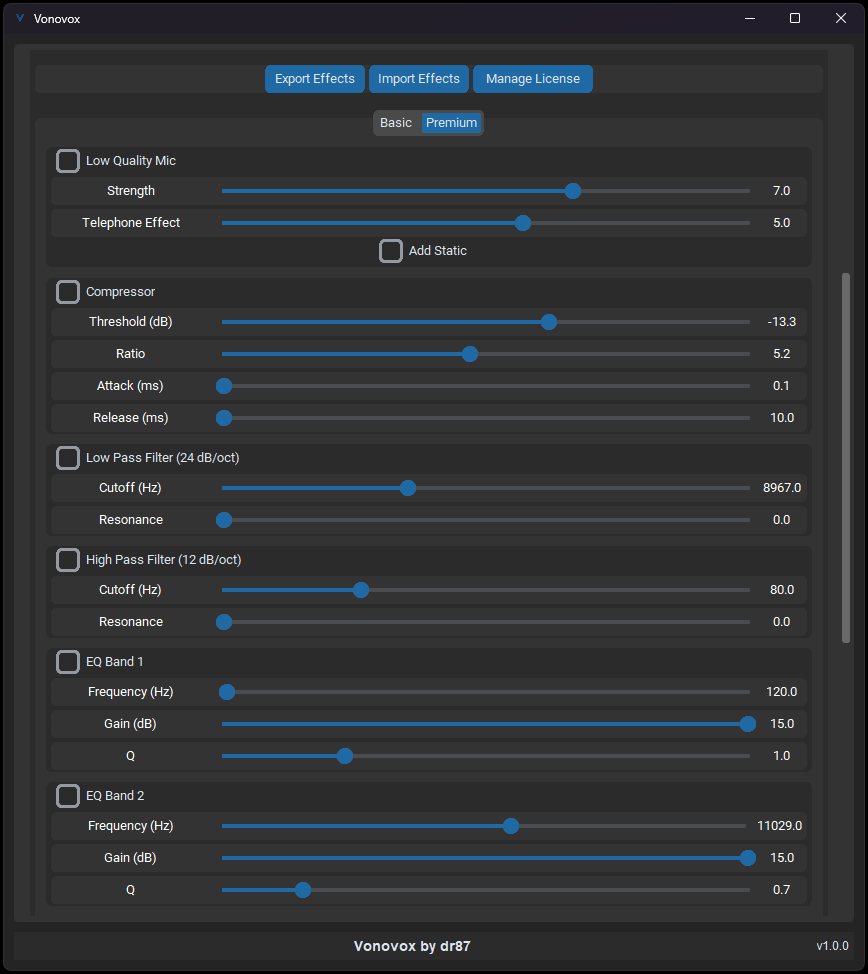
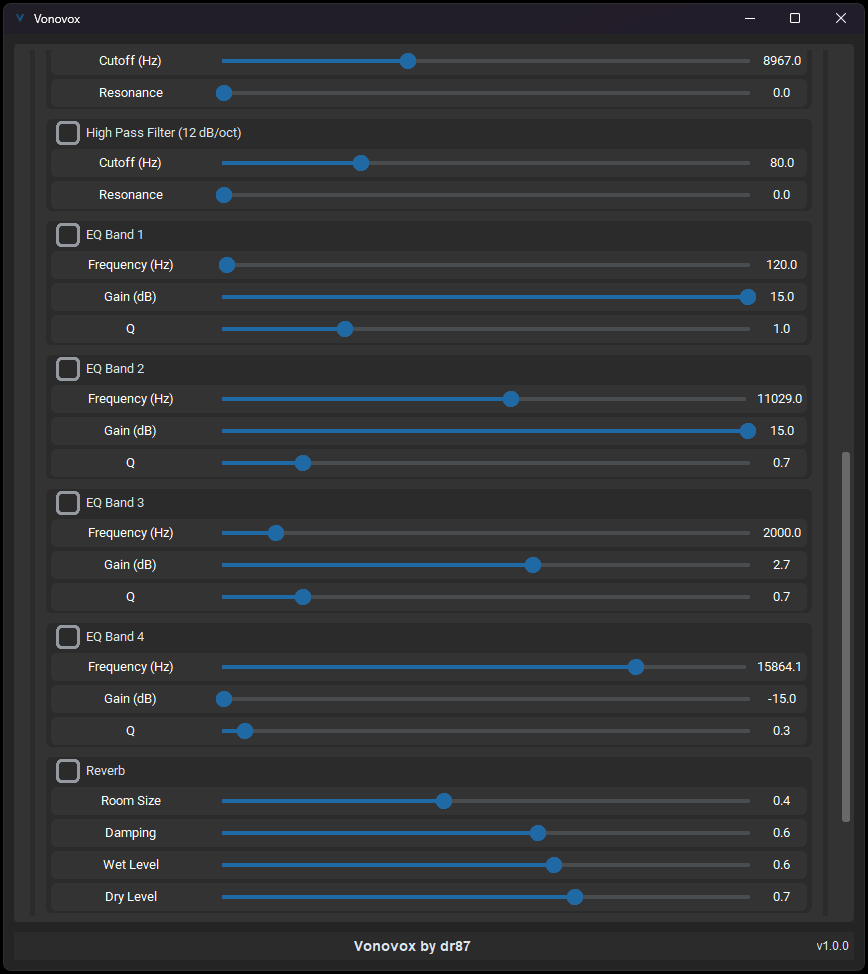

# Vonovox
## Realtime AI Voice Converter for RVC Models

## Overview
FOR NVIDIA GPU's ONLY (GTX 900 or higher): This is a voice converter/changer that has a highly optimized pipeline for CUDA, with the lowest latency and highest model quality I was able to achieve as well as extra post-processing effects. Simple to use and setup.

I wrote this application over many months and hours of development time and testing.

You can join the [discord server](https://discord.gg/c9mbMGxEbR) to get support or ask questions.

## Details
- NVIDIA Only. GTX 900 or later
- Highly Optimized CUDA pipeline. Nearly every operation is processed on the GPU
- Python 3.12.8, PyTorch 2.6.0, CUDA 12.6
- Uses an optimized version of [FCPE](https://github.com/CNChTu/FCPE) for inference
- Modern style GUI written in [CustomTkinter](https://github.com/TomSchimansky/CustomTkinter)
- Only for use with models trained in [RVCv2](https://github.com/RVC-Project/Retrieval-based-Voice-Conversion-WebUI)
- Transformers [implementation](https://huggingface.co/lengyue233/content-vec-best) of [ContentVec](https://arxiv.org/pdf/2204.09224) for speech
- Easy to use and setup - GUI core functional settings kept as minimal as possible
- Good input noise reduction using RNNoise
- Very low latency for realtime standards
- Compiled to C with Cython
- Lightweight with minimal amount of packages
- Self-contained Python environment (no separate Python installation needed)
- Post-processing effects built in with settings
- See requirements.txt for all libraries used.

## Virtual Cable Setup
You should always use [VAC](https://software.muzychenko.net/freeware/vac470lite.zip) over VB-Audio or other options. It works much better with realtime applications and has less glitches and artifacts. Make sure your virtual line(s) are also set at 48000hz (1 channel, 16 bit recommended).

## Setup Instructions
I put a focus to make this setup process as easy as possible.

1. Make sure you have this [Microsoft Redistributable package](https://aka.ms/vs/16/release/vc_redist.x64.exe)
2. Download the latest release on this page
3. Run `setup.bat` to create a local python environment and download all packages and assets
4. Run `start.bat` to start the voice converter. First run may take some extra time.
5. Load whichever RVC v2 model you choose.

You may find RVC models by searching the web. There are many models available. Please use RVCv2. (RMVPE models for best results)

## Sample Rates
I've built this application to be very flexible with device sample rates by using built in resampling instead of raising an error. If your input and output sample rates are different, it will still work well. However you should set your input mic and VAC cable both to 48000hz for the best results. (If your mic doesn't support 48000hz, just use whichever is closest) For models, this doesnt matter. You can use a model trained with any sample rate as long as its RVCv2.

## Hearing the output
You should use Windows built in "Listen to this device" option to hear the output. It's by far the most stable option to hear the exact output and latency.

On Windows 11: To find this go to: 

settings > system > sound > more sound settings (under advanced) >"Recording" tab > find the virtual line you are using (Line 1 if you used VAC. NOT your real mic) right click > properties > "Listen to this device" and apply.

Windows 10 is similar but sound settings may be located elsewhere.

## Using the output voice in applications
Make sure your application or game is using the virtual line you created in VAC. Usually Line 1. If you dont want to hear yourself you can either unmonitor your mic in the previous step, or just turn down or mute Line 1 volume in the volume mixer. (Line 1 will appear as a normal application that has controllable volume)

## Configuration Options

### General Settings
- **Pth Model Files**: RVC v2 trained models only. Only recommended to use models trained with RMVPE pitch extraction. Supports 32000, 40000, 48000 trained models.
- **Input/Output Devices**: Input is your real microphone, output is your VAC line.
- **Pitch**: Change as needed. Adjustable in realtime.
- **Block Size**: Critical setting. The optimal block size is the lowest you can get without audio being choppy. Listen to your output. This is GPU dependent, the more powerful the gpu, the lower the block size you can use. However the optimizations I made allow much smaller block sizes to work on lower end GPUs. Going over 0.20 generally will not improve quality, but is required for lower end cards not to sound choppy.

### Audio Settings
- **Audio Backend**: Use WASAPI unless you have an ASIO interface and know what you're doing (I am not supporting older protocols like MME)
- **Exclusive Mode**: This is WASAPI Exclusive Mode. Leave off unless you know why you need it
- **Sample Rate**: See notes above. Only 48000Hz is available. This is only the outgoing sample rate that matches your VAC line - It is compatible with 32000, 40000, or 48000 models
- **RNNoise**: Forced on for now - greatly reduces input background noise

### Advanced Settings
You can change these if you want, but it's recommended to leave them as is.
- **Lookahead buffer**: Gives the model more or less context to work with. Recommended 2.5 for best quality/latency ratio. The added latency of this setting is far less impactful than the block size.

## Basic Effects
*Note: If you move sliders while in the middle of speaking, sound will have some minor popping. This is completely normal as you are applying effects in the middle of a block of audio being processed. Just don't move the sliders while speaking if possible, but it won't cause any issues.*

- Gain: Control the output voice gain
- Noise Gate: A simple noise gate so the application doesn't try to process low background noise that made it past RNNoise

More coming soon.

## Premium Effects
All optimizations and model inferencing improvements are completely free in the base voice converter. However, these are optional patron subscriber effects that remove the need for external post-processing. Processing from all effects, premium and free, are done directly in the pipeline as the output voice is being produced, making them extremely low latency. Many effects can greatly enhance voice quality if used properly, while some are just for fun. I will continue to add additional effects.

I set decent defaults, but lots of information on setting explanations can be found online, as these effects are very commonly used in audio post-processing. I recommend you do your own research.

1. Compressor
2. Low and High pass filters
3. Four customizable EQ bands
4. Reverb Effects
5. Chorus Effects
6. An adjustable "Low Quality Mic" filter is available. This simulates a lower quality microphone to hide digital artifacts and sometimes sounds way more natural depending on the model.

Im currently working on actively adding more effects. Some of the effects I am writing are custom made by me with effect combinations (just like low quality mic).

You can enable the premium effects by subscribing to the project [patreon](https://www.patreon.com/c/dr87/membership). It supports me to continue to work on this project.

### Why not open source?
I spent several hundred hours developing this. I'm a single developer and I've put a lot of time and effort into this. I may or may not open source the project in the future. For now It's just a personal project that I'm offering free to the community. I do have a few premium post processing effects, but every other core optimization and improvement is free.

## Some Extra Notes

### Choppy during high GPU usage games?
This will be an issue with most realtime voice apps. When you game, your game will use most of the GPU's free resources. I am currently working on writing CUDA stream prioritization to see if it helps. If the GPU usage goes too high, it's hard to avoid choppiness without a dedicated GPU. Lower your game settings if possible. Non-intense games should be fine.

### Multi-GPU Setup Note
*Skip this section if you only have one GPU.*
For users with TWO GPUs in the same system, you must do the following:
1. Open NVIDIA Control Panel
2. Go to Manage 3D Settings > Program Settings Tab
3. Add python.exe from the applications runtime folder (runtime\python.exe)
4. Set both settings "CUDA - GPUs" and "OpenGL rendering GPU" to the GPU you want to use for conversion
5. This will hide the other GPU from being used by the application which is required

### Bugs
1. Rarely when pressing "Start" you will notice a much longer latency in voice processing while speaking. Once you get familiar with how your normal latency feels it's easy to spot. Just press stop and start again. I am working on the fix, but this one is a little harder to track down, it doesn't happen too often.

